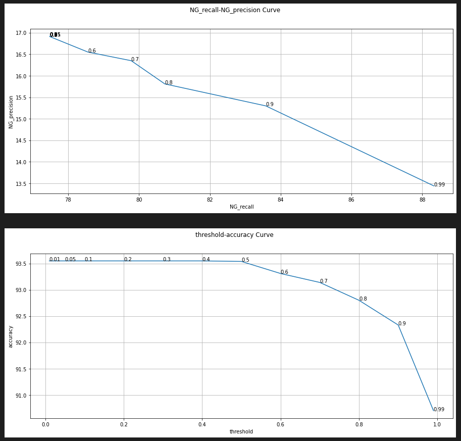
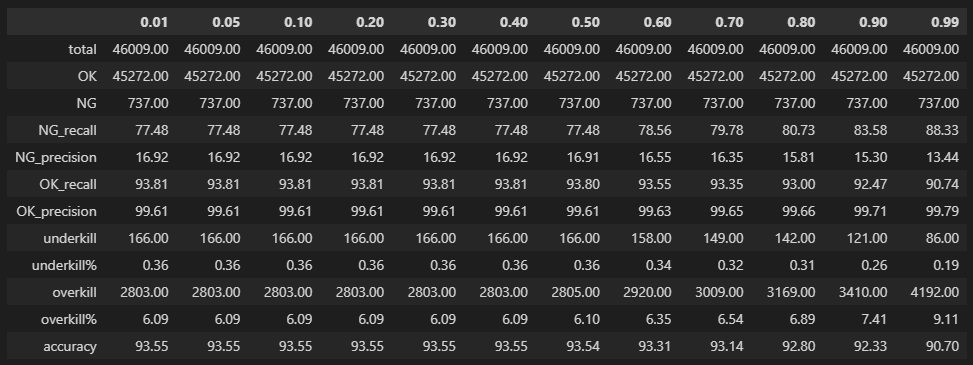

# estimate_performance
* 模組化 AI 各項常用指標
* 主要包含兩個分法 : indicators 與 thresholding
* indicators : input gt 與 prediction，產出 recall、precision、accuracy 等等資訊, 可選擇 output type ( df / dict )。
* thresholding : input threhold[List]，依照給予的 threshold 計算各項指標並畫圖(plotimage模組)。

## 1. indicators method
### 使用方式：
```python=
performance=estimatePerformance(
    gt=df['class'],
    pred=df['pred_class']
).indicators(data_type='df')
```

## 2. thresholding method
### 使用方式：
```python=

threhold=[0.01,0.05,0.1,0.2,0.3,0.4,0.5,0.6,0.7,0.8,0.9,0.99]
performance=estimatePerformance.thresholding(
    gt=df['gt'].replace({'OK2':'OK'}),
    score=df['top1_score'],
    threshold_list=threhold,
    thres_class=df['top1_class'].replace({'MD':'NG'}),
    plot=True
)
```
### 結果:




